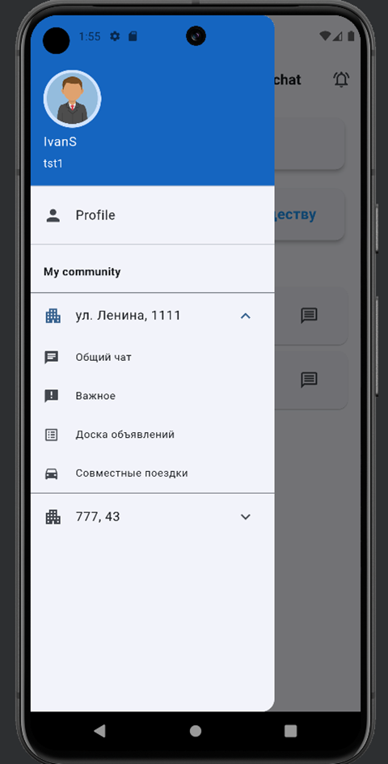
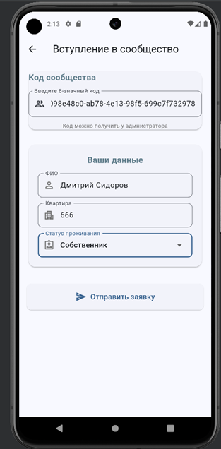
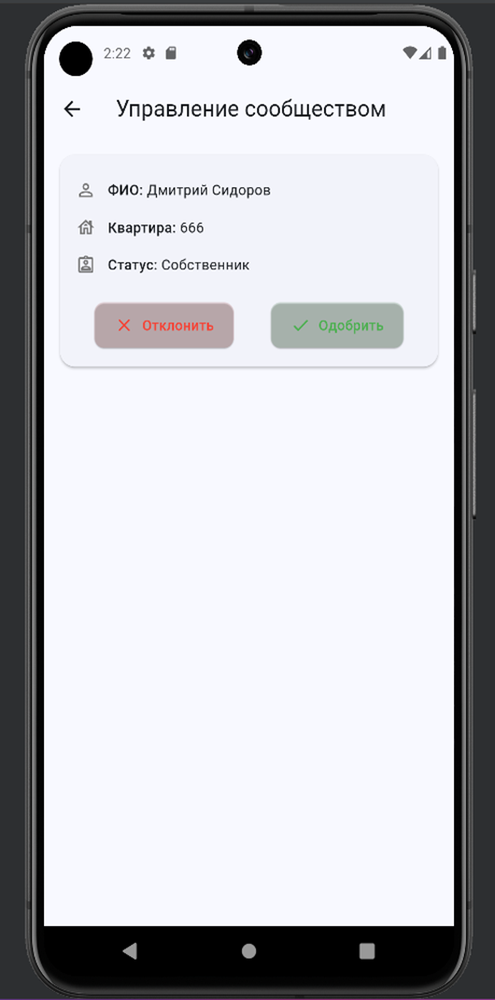
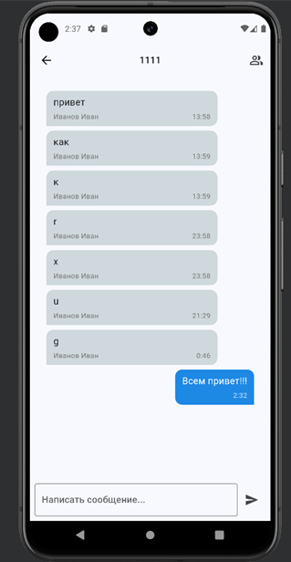
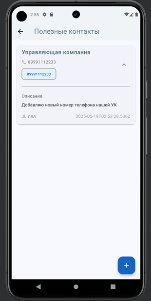
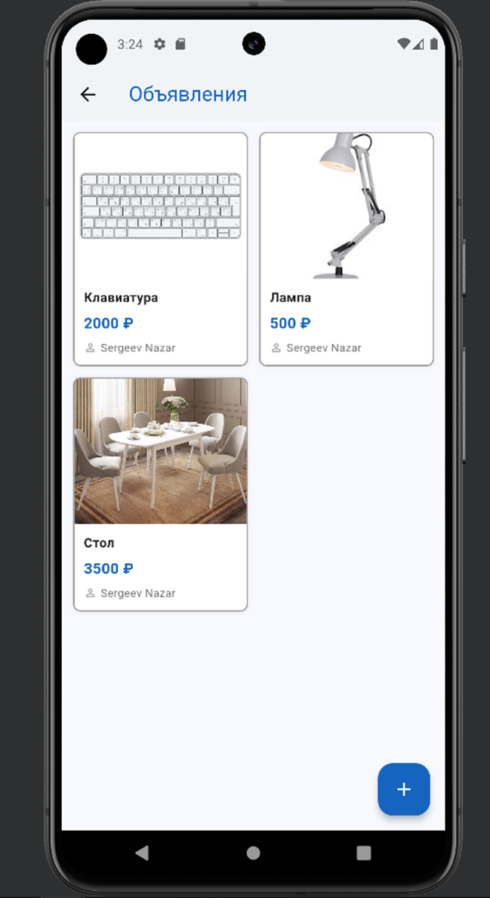
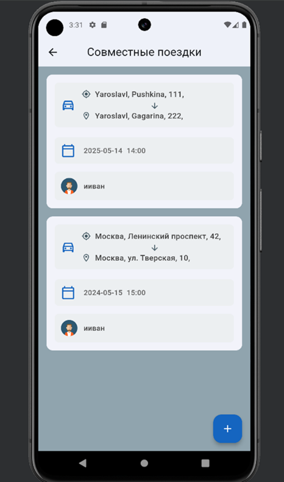

# domochat

Multifunctional mobile application
for effective self-organization of the neighborhood community

## About the app
- Create communities
- Communicate in general and thematic chats
- Add useful contacts
- Post your ads
- Look for fellow travelers and save on a taxi ride

## Screenshots

  
  
  
  
  
  
  
  
  
  

## Backend
[Get acquainted with the backend part of the project](https://github.com/Sokolov1111/domochat_back/tree/master)
